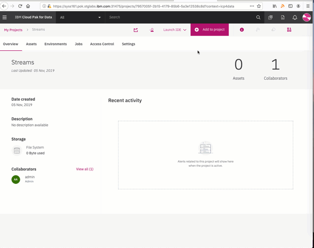

# Starter notebooks for Streams applications

These notebooks are a good starting point for using the [Streams Python API](http://ibmstreams.github.io/streamsx.documentation/docs/python/1.6/python-appapi-devguide/).

### Sample notebook descriptions
- **Start Here:** [Streams-RollingAverageSample](#RollingAverageSample):  If you are new to Streams, get started by using this notebook template. 
- [Streams-BasicSample template](#BasicSample):  Use this template if you are familiar with Streams and need a few code cell examples.
- [Streams-DatabaseSample application](#DatabaseSample): connect to a Db2® Warehouse database, perform some SQL queries, and view the results.
- [Streams-EventStoreSample application](#EventStoreSample): ingests data into a Db2 Event Store table and views the metrics of the insert operation. 
- [Streams-EventStreamsSample application](#EventStreamsSample): ingests data into the IBM Event Streams service and consumes the data from IBM Event Streams.
- [Streams-HbaseSample application](#HbaseSample): Connect to Apache HBase, perform some operations on a table, and view the results.
- [Streams-HdfsSample application](#HdfsSample): connect to Apache Hadoop Distributed File System (HDFS).
- [Streams-KafkaBasicSample application](#KafkaBasicSample):  demonstrates how to create a Streams Python application that connects to a Kafka cluster. 
- [Streams-KafkaParallelSample application](#KafkaParallelSample):  connects to a Kafka cluster by using a consumer group and uses partitioned parallel processing of fetched messages.
- [Streams-PMMLScoringSample application](#PMMLScoringSample): perform scoring with a Predictive Model Markup Language (PMML) model and view the results.
- [Streams-SPLToolkitsTutorial](#SPLToolkitsTutorial): demonstrates how to discover toolkits and python packages, shows how to integrate SPL toolkit operators in your topology
[See below](#howto) for how to add these notebooks to IBM Watson Studio or IBM Cloud Pak for Data.

### Find more samples
- Search the [IBM Streams samples catalog](https://ibmstreams.github.io/samples/?filter=python) for more advanced Python samples.

### Getting help

Open an issue or [ask a question on the IBM support forums](https://www.ibm.com/mysupport/s/forumsproduct?language=en_US&name=Streams&id=0TO50000000IQN0GAO).

### Importing a notebook in IBM Cloud Pak for Data (CPD) or Watson Studio

Follow these steps to import any of the notebooks in this repository:

- Copy the GitHub URL to the notebook.
- From your Cloud Pak for Data or Watson Studio project, click "Add notebook". 
- Select the **From URL** tab, and paste the URL in the **Notebook URL** field.
- Click **Create notebook**.

**Streams-RollingAverageSample application**
 If you are new to Streams, get started by using this notebook template. This template provides detailed instructions on how to create a streaming Python application, which simulates a data hub that receives readings from sensors. You can find examples of how to perform the following tasks:

    - Set up your data connections.
    - Create a streams processing application by creating a Topology object, defining sources, analyzing data, and defining the output.
    - Submit a job to the StreamsStreams instance to start the streams processing application. Applications that run on the Streams - instance are called jobs.
    - Connect to the job to view data.
    - Cancel the running job.

Streams-BasicSample template
    If you are familiar with Streams and need a few code cell examples, use this template to get started. This template includes all Python code cells that you need to perform the following tasks:

        Create a streams processing application.
        Submit a job to the Streams instance.
        View the data collected by the streams processing application.
        Cancel the running job when needed.

    You can modify the template cells as needed to create your own streams-processing applications.

Streams-SPLToolkitsTutorial template
    If you are familiar with Streams Processing Language (SPL) and want instructions to use SPL composites and operators, use the Streams-SPLToolkitsTutorial notebook. This tutorial includes all Python code cells that you need to perform the following tasks:

        Discover toolkits that are installed on the Streams build service
        Launch the SPL main composite
        Work with microservices
        Integrate SPL operators in a Python topology

    You can modify the template cells as needed to create your own streams-processing applications.

In addition, these templates include the following code samples and sample applications:

Streams-DatabaseSample application
    This sample application demonstrates creating a Streams Python application to connect to a Db2® Warehouse database, perform some SQL queries, and view the results. It includes all Python code cells that you need to perform the following tasks:

        Set up your data connections.
        Create a streams processing application.
        Submit a job to the Streams instance to start the streams processing application.
        Cancel the running job.

Streams-EventStoreSample application
    This sample application demonstrates creating a Streams Python application that ingests data into a Db2 Event Store table and views the metrics of the insert operation. It includes all Python code cells that you need to perform the following tasks:

        Set up your data connections.
        Create a streams processing application.
        Submit a job to the Streams instance to start the streams processing application.
        Connect to the job to view metrics.
        Cancel the running job.

Streams-EventStreamsSample application
    This sample application demonstrates creating a Streams Python application that ingests data into the IBM Event Streams service and consumes the data from IBM Event Streams. It includes all Python code cells that you need to perform the following tasks:

        Set up your data connections.
        Create a streams processing application.
        Submit a job to the Streams instance to start the streams processing application.
        Connect to the job to view data.
        Cancel the running job.

Streams-HbaseSample application
    This sample application demonstrates creating a Streams Python application to connect to HBASE, perform some operations on a table, and view the results. It includes all Python code cells that you need to perform the following tasks:

        Set up your data connections.
        Create a streams processing application.
        Submit a job to the Streams instance to start the streams processing application.
        Connect to the job to view data.
        Cancel the running job.

Streams-HdfsSample application
    This sample application demonstrates creating a Streams Python application to connect to HDFS, perform some operations on a table, and view the results.. It includes all Python code cells that you need to perform the following tasks:

        Set up your data connections.
        Create a streams processing application.
        Submit a job to the Streams instance to start the streams processing application.
        Connect to the job to view data.
        Cancel the running job.

Streams-KafkaBasicSample application
    This sample application demonstrates how to create a Streams Python application that connects to a Kafka cluster. The focus of this notebook is on creating a connection with a Kafka cluster. It includes all Python code cells that you need to perform the following tasks:

        Set up your data connections.
        Create two streams processing applications.
        Submit two jobs to the Streams instance to start the streams processing applications.
        Connect to the consumer job to view data.
        Cancel the running jobs.

Streams-KafkaParallelSample application
    This sample application demonstrates how to create a Streams Python application that connects to a Kafka cluster by using a consumer group and uses partitioned parallel processing of fetched messages.. It includes all Python code cells that you need to perform the following tasks:

        Set up your data connections.
        Create two streams processing applications.
        Submit two jobs to the Streams instance to start the streams processing applications.
        Connect to the consumer job to view data.
        Cancel the running jobs.

Streams-PMMLScoringSample application
    This sample application demonstrates creating a Streams Python application to perform scoring with a Predictive Model Markup Language (PMML) model and view the results. It includes all Python code cells that you need to perform the following tasks:

        Set up your data connections.
        Create the application.
        Submit a job to the IBM Streams instance to start the streams processing application.
        Connect to the job to view data.
        Cancel the running job.

Streams-SPLToolkitsTutorial
    This notebook demonstrates how to discover, use, build and launch SPL toolkits in a Python notebook. It includes all Python code cells that you need to perform the following tasks:

        Discover Python packages.
        Discover Toolkits on Streams build service.
        Create the application (a) sample application (b) microservices (c) integrate SPL operators.
        Submit a job(s) to the IBM Streams instance to start the streams processing application.
        Cancel the running job(s).
