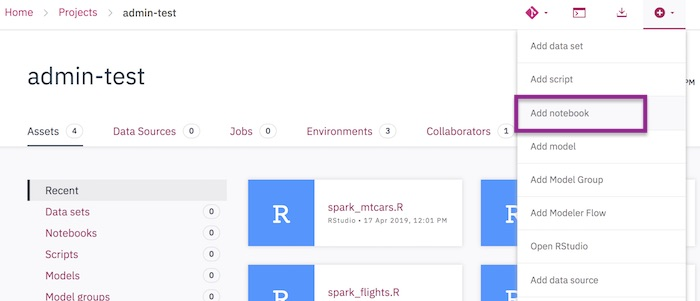
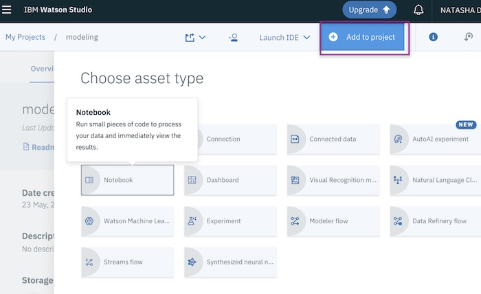
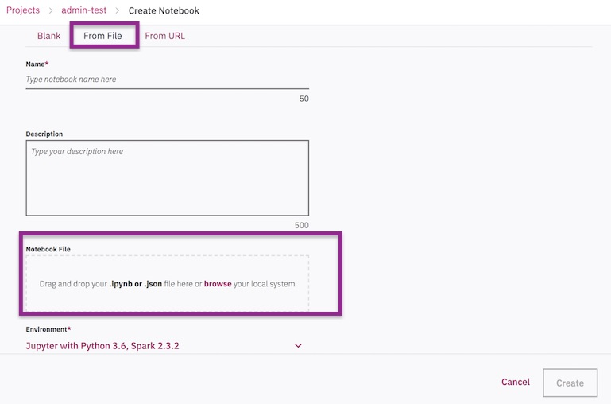

# Starter notebooks for Streams applications

These notebooks are a good starting point for using the [Streams Python API](http://ibmstreams.github.io/streamsx.documentation/docs/python/1.6/python-appapi-devguide/).

[See below](#howto) for how to add these notebooks to IBM Watson Studio or IBM Cloud Pak for Data.

### Find more samples
- Search the [IBM Streams samples catalog](https://ibmstreams.github.io/samples/?filter=python) for more advanced Python samples.
- Visit the [Streams community, Streamsdev](https://developer.ibm.com/streamsdev/) for articles and tutorials.

### Getting help

Open an issue or [ask a question on the Streamsdev forums](https://developer.ibm.com/answers/smart-spaces/22/streamsdev.html).

### To use with IBM Watson Studio or IBM Cloud Pak for Data (CP4D):

Add a notebook to your project by clicking "Add notebook".

**IBM Cloud Pak for Data:**

**IBM Watson Studio:**

Choose _From File_ if you have downloaded the notebook, or _From url_ to use the [raw github URL of the notebook](https://i.stack.imgur.com/V05bP.png).

